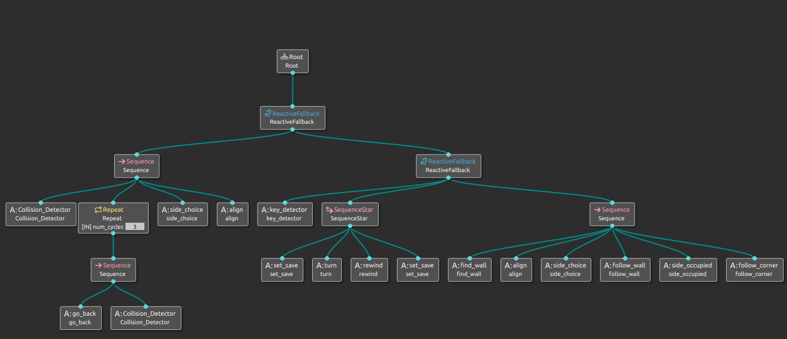

# Mobile Robotics Project

### _Behavior Tree High level control_
This repository contains the project based on the Behavior tree library (https://www.behaviortree.dev/), the lib version used is V3.7.0.


---

# Goals
- Make an high level FSM controller to find a wall, and follow it
- Implement a reverse action based on previous actions
- Implement a collision detector and related routine for collision avoidance

## Requirements 

- ROS2 Foxy
- geometry_msgs
- BTree\_cpp\_v3
- rclcpp
- sensor_msgs
---------------------------------------------------------

# Case studies
Here we report all the cases that are handled by the tree.


## Tree nodes



## Installation

> The most difficult part is make everything compilable, then is way easyer i hope 
> \-cit


Install the dependencies and devDependencies and start the program.

```bash
git clone this-repository
colcon build
ros2 run wall_follower_btree wall_follower_main
```


In case of issues with unity we suggest to use this command, 

```bash
MESA_GL_VERSION_OVERRIDE=4.5 MESA_GLSL_VERSION_OVERRIDE=450 unityhub
```
this starts unityhub with OPENGL 4.5 .

## Acknowledgements

This work has been devoleped by Denis Tognolo and Antonino Parisi at the University of Verona.

## License

MIT

**Free Software, Hell Yeah!**

# Notes 

**Leave a star if this project ==helped== you! Thanks.**

**You can find the report of this project inside the images folder as documentation of the work done.**
